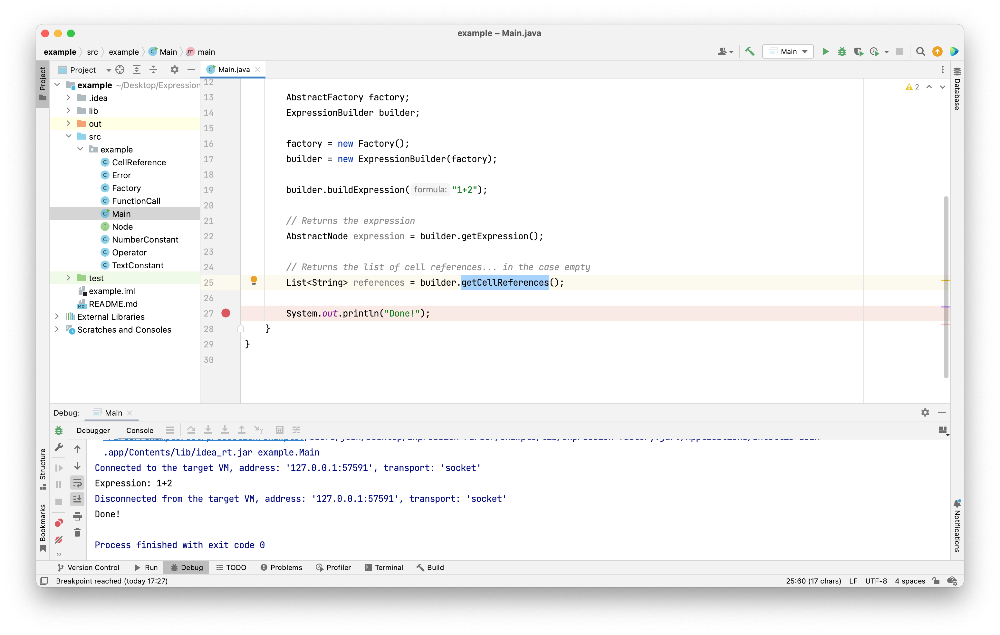
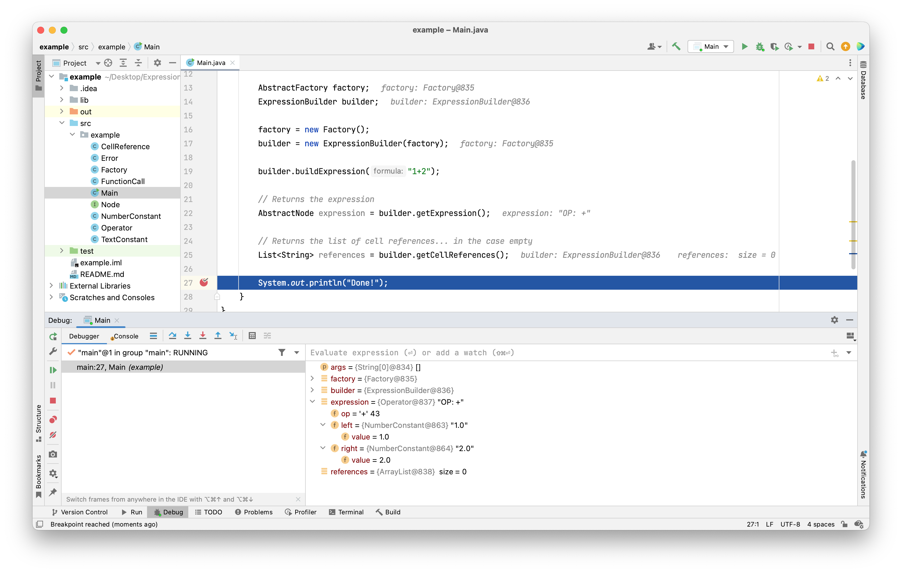
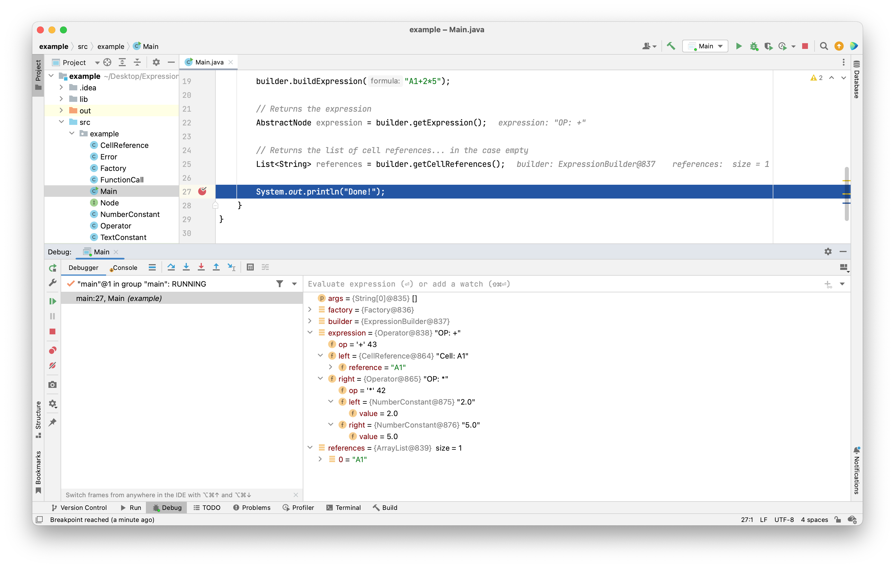

# Expression Builder

Version 1.1 - 6th December 2022

## Introduction

This file describes the expression parser that can be used in your project
to parse the formulas. More specifically, given a string that is a valid formula, 
this component is able to generate a tree or 
[Composite pattern](https://refactoring.guru/design-patterns/composite) that
represents the formula. This composite can later be evaluated to calculate the 
value of the formula taking into account the values of other cells in the 
spreadsheet.

The expression parser is using the [Abstract Factory](https://refactoring.guru/design-patterns/abstract-factory) 
design pattern to isolate itself of the concrete design of your composite nodes.
This way, each time the parser requires to build, for example, a node representing a
number, it will not build it itself, but call a method in the factory that you must
provide, that will be the responsible to create the specific node that suits your
project.

## JAR Files

In the lib folder, there is the `expression-factory.jar` that you must include
in your project.

## Example

In the example folder, you can find a minimal example that uses the expression 
parser.

### Main

This class is the main example. 

```java
package example;

import parser.AbstractFactory;
import parser.AbstractNode;
import parser.ExpressionBuilder;

import java.util.List;

public class Main {
    public static void main(String[] args) {
        System.out.println("Expression: 1+2");

        AbstractFactory factory;
        ExpressionBuilder builder;

        factory = new Factory();
        builder = new ExpressionBuilder(factory);

        builder.buildExpression("1+2");

        // Returns the expression
        AbstractNode expression = builder.getExpression();

        // Returns the list of cell references... in the case empty
        List<String> references = builder.getCellReferences();

        System.out.println("Done!");
    }
}
```

1. First, we create the `AbstractFactory` that it is responsible of creating nodes. 
A concrete implementation of this interface must be provided by yourselves. On section 
XXX, we will have a look on the basic implementation for this example, in the class `Factory`.

2. Next, we create a `ExpressionBuilder` passing our `Factory` to it.

3. After this, we can execute the expression builder, calling the method `buildExpression()` 
passing to it the formula that we want to parse.

5. For retrieving the resulting tree, we use the `getExpression()`. This will return the 
root node of your composite. We can store this on an `AbstractNode` variable or in any other
interface that your concrete nodes implement.

6. The parser also returns a list of cell references that are referenced in your formula. This 
can be obtained with the `getCellReferences()` method. 

### Factory

This class is the concrete implementation of the `AbstractFactory` for this example. The 
`AbstractFactory` interface has 6 methods that you have to implement, each of them to build
nodes of the following types:
- Operators, i.e +,-,*,/
- Functions, i.e `MIN`,`MAX`...
- Number, i.e 1, 545, 45435435....
- Text, , i.e "Header", "Title"...
- Cell Reference, i.e A1, C23...
- and finally, an Error node with information about the problem parsing the formula.

The provided implementation, generates nodes that maps one-to-one the provided interface, 
but this is not mandatory. For example, you can generate different nodes for the different
operators (+,-,*,/).

```java
public class Factory implements AbstractFactory {
    @Override
    public AbstractNode buildOperator(char op, AbstractNode left, AbstractNode right) {
        return new Operator(op, left, right);
    }

    @Override
    public AbstractNode buildFunction(String name, AbstractNode[] parameters) {
        return new FunctionCall(name, parameters);
    }

    @Override
    public AbstractNode buildNumberConstant(double number) {
        return new NumberConstant(number);
    }

    @Override
    public AbstractNode buildTextConstant(String text) {
        return new TextConstant(text);
    }

    @Override
    public AbstractNode buildCellReference(String reference) {
        return new CellReference(reference);
    }

    @Override
    public AbstractNode buildError(String detail) {
        return new Error(detail);
    }
}
```
### Node

Equivalently, `Node` is the specific implementation of the `AbstractNode` for this
example. Notice, that no method is enforced in this interface. You should put here 
all the methods that all your nodes must implement as a base ancestor of the nodes 
hierarchy.

### CellReference, Error, FunctionCall, NumberConstant, Operator and TextConstant.

This classes implement all the different concrete nodes that the example needs. Notice
that this classes only store the data from the Expression Builder. They do no calculate
final value of an expression, this is something that it is left as an exercise for the
reader.

Let's have a look on one of the complex nodes, `Operator`:

```java
package example;

import parser.AbstractNode;

public class Operator implements Node {
    protected char op;
    private AbstractNode left;
    private AbstractNode right;

    public Operator(char op, AbstractNode left, AbstractNode right) {
        this.op = op;
        this.left = left;
        this.right = right;
    }

    public String toString() {
        return "OP: "+op;
    }

    public AbstractNode getLeft() {
        return left;
    }

    public AbstractNode getRight() {
        return right;
    }
}
```
Basically it implements the `Node` interface, has three fields for storing the left and
right operands and the operator: +,-,* or /.

## Usage

Let's put a breakpoint on line 27, so we can analyse the state of the different variables and
launch the Main class in debug mode.



When the debugger stops on line 27, we can see the different variables in Debug window, and we
can expand them, to view their fields. Expand the expression, we can see that it is an `Operator` node
with op(erand) equal to +. If we expand the left and right fields, we can see that these nodes are of 
type `NumberConstant` and their values.  



We can check with other formulas, change the formula on line 19 and see the different results.

